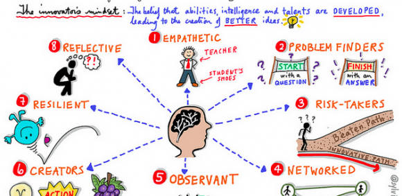

import Video from '../lib/video';

Before I took BMGT 289B, I was [already thinking about how to become more innovative](#pages/intro).
I wanted to learn more about it as a science; I wanted to understand what made
innovators tick, and the different steps I could take to up my game. Because I
am in Computer Science and quite attuned to today's tech world, I was already
used to seeing lots of groundbreaking new ideas coming out of my field constantly.
I wanted to join the fray and to leave my mark on the world with ideas and creations
of my own. 

BMGT 289B gave me lots of insight on how to achieve this goal. I learned a lot
in this class, from the innovator's mindset to creative confidence to what makes
organizations innovative. I have learned a few broad lessons from these insights,
lessons that changed the way I look at and pursue innovation.

## Innovation Starts From Within

Rather than being a random process or a trait you are born with, innovation is a
skill, process, and discipline. This means it can be learned and practiced.
Like all other skills, learning how to innovate
starts with a decision. *Do I want to be a better innovator?* Although it sounds
simple, most people never even reach a stage where they think such a decision
is possible. This requires a certain [mindset](#posts/2-what-does-it-take-to-innovate),
but more than that, it requires a collection of measurable and learnable personality
traits. 

### Bold Confidence

As Tom and David Kelly describe in their book *Creative
Confidence*, many people have beliefs that get in their own way. They think that
they can't be creative, that they aren't a "creative type", and are therefore
unable to innovate. **They let their fear and doubt cloud their judgment**.
In reality, *everyone* is a creative type. Research conducted
by the authors of [The Innovator's DNA](https://www.amazon.com/Innovators-DNA-Mastering-Skills-Disruptive/dp/1422134814)
shows that **creativity is 30% nature and 70% nurture**. Innovation also requires
taking risks. If you let the fear of failure get to you, you may never take the
first steps towards innovation. Learning *risk management* over *risk aversion*
is key. Confidence is key, but it must never devolve into arrogance. The key to
keeping confidence from turning into arrogance is to have enough humility to accept that
it is impossible to know everything, and that you should always seek to learn more.
Humility is a must-have for a growth mindset, another key component of the
innovator's mindset.

### Passion and Playfulness
Passion is what drives people to act. There's a reason why it is a cornerstone
of the 3P framework. It acts as a motivator and guides your actions. Your purpose
acts as a reason to grow, but **passion is the fuel that makes it happen**. Playfulness
is a must for experimenting. Building new things and being creative is fun!

### A Growth Mindset
Nobody stuck in ways of old will ever be able to shape the new. Innovation
requires constant learning and improvement. You must be able to explore
and accept new things or risk being left in the dust. A great example
of this is the [Incumbent's Curse](http://facultyresearch.london.edu/docs/incumbent's_curse.pdf).
Old companies who are stuck in their old ways, who are afraid to change
what they do or cannibalize their own products will be cannibalized by others.
Take Kodak, who [failed to shift towards digital cameras](https://www.forbes.com/sites/chunkamui/2012/01/18/how-kodak-failed/#424718c66f27).
They paid heavily for that mistake, filing for
[Chapter 11 bankruptcy protection](https://www.forbes.com/sites/ericsavitz/2012/01/19/kodak-files-chapter-11/#31c8a0a341b2)
in January 2012. Another example is Intel, who was late to the smartphone
processor game and had to
[exit the market, taking 12,000 jobs with them](https://www.theverge.com/2016/5/3/11576216/intel-atom-smartphone-quit).

## Innovation is a Team Sport

No person can innovate alone. It takes a well-oiled organization with
[innovation baked into their culture](#posts/4-what-makes-organizations-innovative)
in order to innovate effectively. Successful innovators share their ideas
with others, soak up ideas others share with them, and work together to bring
their innovations to life. 

## Innovation is Exciting and Fun

Not only does having fun help with innovation, but it is valuable in its own
right. Having fun with what you do links back to being passionate about what
you do, as described above. The importance of having fun can be seen in the FISH!
Philosophy. The FISH! Philosophy is a set of practices developed by a fish market
stand in Seattle. These practices brought them success, and now they help teach other
organizations these practices to help them become more successful as well.

<Video url="https://www.youtube.com/watch?v=_AAQT6ifGys" />

## Conclusion

Being innovative or not is a set of choices we make every day. While small,
these decisions build up and have a great impact on your life. Not only
do they make you a more effective innovator, but they are the foundation of a
better life.
