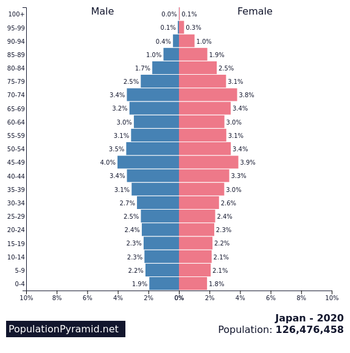

Our quickly changing world is staring down the barrel of even more change
happening even more quickly. There are several key global trends that our
world is going to have to face, and innovation will be key to how we deal
with these challenges

## Trend 1: Demographic Shifts

The makeup of the world's population is changing. Modern medicine is allowing
us to live longer and longer, and increased urbanization means people are having
fewer kids. Around the world, developed nations are seeing their population
growth plateau or go negative. For an idea of what the future holds, just
take a look at Japan. Childbirth has drastically decreased, and their citizens are
having kids later and later - if at all - in favor of progressing their careers.
Coupled with longer lifespans, the results are astounding. The demographic
situation Japan finds itself in can be summed up by its population pyramid.

The shrinking workforce is struggling to maintain support for social programs,
such as Medicare and Medicaid. Innovative solutions will be needed to address
the growing number of problems related to this aging population - and fast.

## Trend 2: Automation

The Digital Revolution has ushered in huge upheavals in the way we work, play, and live.  Menial and repetitive tasks can be easily automated by robots. Robots are cheaper than their human counterparts and get the job done quicker, more efficiently, more reliably. As a result, hundreds of thousands of jobs will be replaced by robots. As technology gets better, more and more types of jobs will be replaceable. The advent of machine learning may mean that no job is un-automatable. The societal shift will be drastic, and we are already seeing the impacts of automation in today's society.

## Trend 3: Economic Uncertainty

As global tensions rise, economic grown is projected to slow down. 2019 saw 
[economic growth hit 2.3%](https://apnews.com/43db310d5fce2a745bdc974815b15a2e),
the lowest rate of growth for the decade. The global Coronavirus pandemic has
not made things any better. The IMF projects that the
[global economy will shrink by -3% in 2020](https://www.imf.org/en/Publications/WEO).
30-year treasury bonds have [dropped to around 1.3%](https://www.treasury.gov/resource-center/data-chart-center/interest-rates/pages/textview.aspx?data=yield), and the Fed interest rate has 
[dropped to 0.00%-0.25%](https://www.bankrate.com/rates/interest-rates/federal-funds-rate.aspx)
as of writing this. Global outlooks are a little shaky, and our current tools
for stimulating economic growth are getting weaker from overuse. Entrepreneurs and
politicians alike will need to face these challenges head on to secure
the world's financial future, or we all risk facing dire consequences. 