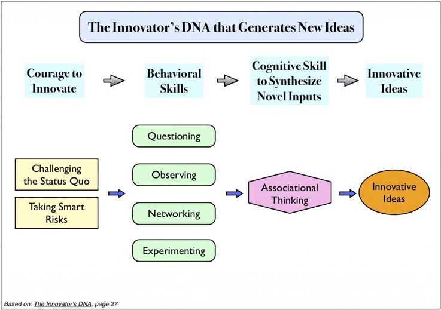

Innovation starts how you think, what you believe, and how you view the world around you. 
Along with [an innovative mindset](#posts/2-what-does-it-take-to-innovate),
you must look at the world around you through a questioning and perceptive
lense.  [The Innovator's DNA](https://hbr.org/2009/12/the-innovators-dna)
framework lays out five crucial skills: Associating, Questioning, Observing,
Experimenting, and Networking.

## 1. Associating

Being able to associate wildly different parts of your life lets you put together
ideas nobody thought about before, thus sparking innovation. To spur this process,
I recommend learning about anything you can get your hands on. The broader
your experience set, and the broader range of knowledge you have, the more likely
you will be to combine ideas nobody has thought of before - and maybe
change the world.

## 2. Questioning

Innovators hate the status quo and seek to change it. Challenging commonly
held beliefs can lead to new ways of doing things - i.e. innovations. When
combined with observation, as described below, this skill can be extremely
powerful.

## 3. Observing

Innovators constantly look at the world around them, taking in information,
looking at details, always in search of improvements they can make. An observation
today could lead to an association with another thing observed yesterday,
sparking a brand new idea. Questioning what you see can lead you down a path
towards a new idea as well. Treat the world around you as an interesting
specimen to be studied, and yourself as a scientist hunting for new clues.

## 4. Experimenting

Observations lead to questions, which must be answered by experimenting with
the world around you. Innovators constantly poke and play with the world around
them to figure out how it works. These experiments don't have to be peer-reviewed
research papers by research scientists, they could be anything. Just by trying
out new things, you could stumble upon the next great idea.

## 5. Networking

Networking and association go hand in hand. By networking with people in different
fields and with different skillsets, you can get fresh perspectives and ideas
that change the way you look at things. By tapping the knowledge and experience
of the people around you, you can come across brand-new ways of thinking about
the world or a question you are trying to solve. According to Alan Gregerman,
[99% of innovative ideas are based on ideas and work of others](https://alangregerman.com/2013/10/01/power-making-things/). A bigger network means more exposure to those ideas
and work, leading to more innovation.

## Takeaways

At the core of every single one of these skills is a common trait: Curiosity.
**Curiosity unbounded by fear or self-doubt is the single greatest asset an 
innovator has**. The Innovator's DNA skills revolve around this concept and are
related to curiosity itself or to fueling curiosity. Obtaining this trait is no easy feat, as is evident by how
few amazing innovators there are in our world. However, it is the key to 
great new ideas.