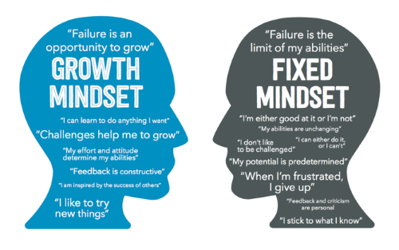

The rate of innovative change in our world is extremely high and getting higher.
Our world now faces [new challenges that will continue to accelerate innovation](#posts/1-trends-accelerating-innovation),
meaning that this acceleration will not be slowing down anytime soon. In order to
adapt to this nonstop change, I have to be changing nonstop as well.  I must 
constantly view myself as a work in progress, and therefore I must continue to
learn and grow. Reid Hoffman from *The Startup of You* calls this mentality
**permanent beta**, while others such as Satya Nadella call this the **growth mindset**.
This is opposed to a fixed mindset, where you get stuck in your ways and resist
change.

Satya Nadella's idea of a *learn it all* culture, rather than a *know it all* culture,
is very powerful to me. I believe that as long as I can continue to try new things,
learn as much as I can, refuse to get stuck in old ways, and face challenges
head-on, I will be able to effectively adapt to the accelerating change facing
the world.